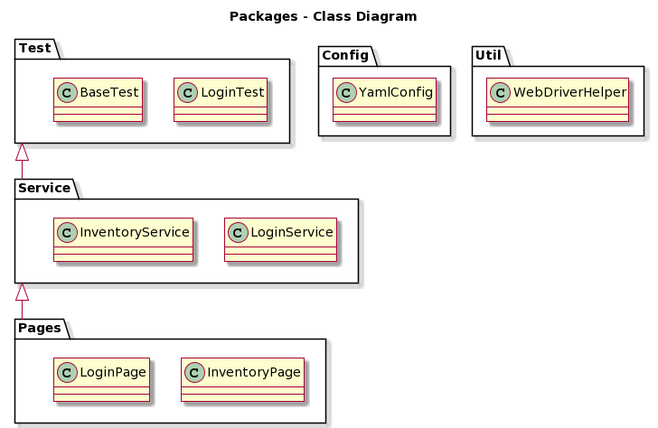

# Automation Coding Exercise 

## Preconditions

- Have [Maven](https://maven.apache.org/install.html) installed.
- Have [Java 8](https://docs.oracle.com/javase/8/docs/technotes/guides/install/install_overview.html) installed.

## Functionality 
- [x] 1 Scenarios for 'Shopping cart' and 'Login'
- [x] 2_1 Test framework with 'Junit 5' and Selenium
- [x] 2_2 Take a screenshot when a test fails
- [x] 3 Automated test cases from the list in the first point.
- [x] 4 One of the test cases fails intentionally.
- [ ] 5 Rest service.

Notes: 

- [x] Execute in Chrome browser.
- [ ] Execute on another browser.

# Execute 

- To run the tests execute `mvn test` on a terminal in the root folder as a path.

- To generate the report execute `mvn allure:report` on a terminal in the same path.

- The report will be generated on the path `/target/site/allure-maven-plugin`

To see the individual test results go to the side bar option `xUnit`

- To set custom properties create a file under `src/test/resources/` called `application.yml`

```yaml
application:
  standard_user:
    username: standard_user
    password: secret_sauce
  locked_out_user:
    username: locked_out_user
    password: secret_sauce
  problem_user:
    username: problem_user
    password: secret_sauce
  performance_glitch_user:
    username: performance_glitch_user
    password: secret_sauce
```

Note: For security reasons is a bad practice to have passwords hard-coded into the source code or pushed to a repository.
In a normal situation the passwords should be on a configuration file as the one contained here but should only be in the server configuration or the local configuration.
The  `application.yml` is pushed to the repository only for demonstration purposes.

## Architecture



### Test folder

Contains the test cases that will be executed and the logic to take a screenshot when a test fails.

### Service layer

Works as an intermediary between the test layer and the pages layer.
It does also contains the allure sentences that will show up in the report. 

### Pages Layer

It contains the elements of the DOM. Those selectors are private so they are not access directly. 
It follow the Martin Fowler patter, usually known as [Page object](https://martinfowler.com/bliki/PageObject.html)

**Notes**: This layers responsibility distribution will allow
 having one of the technology to change without affecting the other parts of that application.
 
### Utils

Contains utility classes that are shared by several tests but it is not related to the 
functionality itself.

### Configuration

Contains configuration files like the YML configuration.

## Pending functionality + Nice to have

Nice to have 
- [ ] Move the the `takeScreenshot()` method to an utility class inside the Utils folder.
- [ ] Add the browser data to the configuration file or create a new file containing the browser data so it is nor hardcoded.

```yaml
browser:
  name: chrome
  version: 88.0.4324.96
execution:
    headless: true
    start-maximized: false
    ...
```

- [ ] Create a factory method to choose which browser will execute the test cases.


